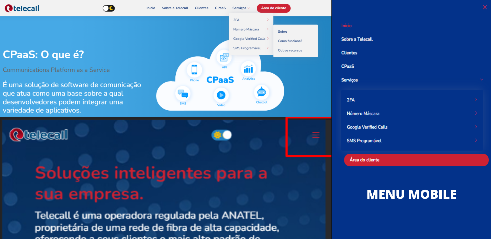

# Pagina-inicial
 
 <!---Esses são exemplos. Veja https://shields.io para outras pessoas ou para personalizar este conjunto de escudos. Você pode querer incluir dependências, status do projeto e informações de licença aqui--->


>  Projeto desenvolvido nas tecnologias: HTML, CSS, JavaScript, BootStrap, AOS, Swiper.
>  Projeto totalmente responsivo, com design simples e bonito, menus e submenus interativos.
>  Página inicial + 6 Subpáginas (CpaaS, 2FA, NumberMask, Google Verified, SmS e Instituicional).

## ☕ Design <Pagina-inicial>
```
O design é minimalista e bonito, o que torna todo o site de fácil entedimento ao usuário.
```


## 🌙 DarkMode Aplicado em todas às páginas. <Pagina-inicial>

```
O Darkmode é armazenado no LocalStorage. Logo quando ativado, ele guarda o tema para todas as outras páginas acessadas.
```


## 🌙 Menus e Submenus <Pagina-inicial>

```
Os menus e submenus, estão todos responsivos para mobile, ocultando a navbar e transformando-a em um menu de 
hamburguer, o que torna a experiência do cliente melhor.
```



```
Há um formulário de contato, com iFrame no Maps do Google, interativo, podendo ver claramente o local que o 
desenvolvedor colocar, para o cliente é muito útil para a localização do escritório da empresa.
```
 


 
O site foi desenvolvido utilizando o Framework BootStrap, biblioteca AOS e Swiper.

O site todo está com a biblioteca AOS, que faz com que os conteúdos surjam conforme o conteúdo for scrollado.
Também contém a biblioteca Swiper, que nos permite ter o Slide de depoimentos.
 
### Ajustes e melhorias

Projeto concluído:

- [x] Layout e Design
- [x] Menus e Submenus responsivos
- [x] Responsividade
- [x] DarkMode
- [x] Carrousel
- [x] Google Maps
- [x] Projeto finalizado.

## 💻 Pré-requisitos

Antes de começar, verifique se você atendeu aos seguintes requisitos:
<!---Estes são apenas requisitos de exemplo. Adicionar, duplicar ou remover conforme necessário--->
* Você instalou a versão mais recente de `<HTML5, CSS3 E JAVASCRIPT>`
* Você tem uma máquina `<Windows / Linux / Mac>`.
* Você leu `<guia / link / documentação_relacionada_ao_projeto>`.

## 🚀 Instalando <Pagina-inicial>

Para instalar o <Pagina-inicial>, siga estas etapas:

Linux, macOS e Windows:
```
<Entre no repositório do GitHub e baixe o repositório na opção "Download ZIP".
<Extraia o arquivo .zip em uma pasta".
<Abra a pasta pela IDE de sua preferência.
```


[⬆ Voltar ao topo](#Tela-de-Autenticacao)<br>
